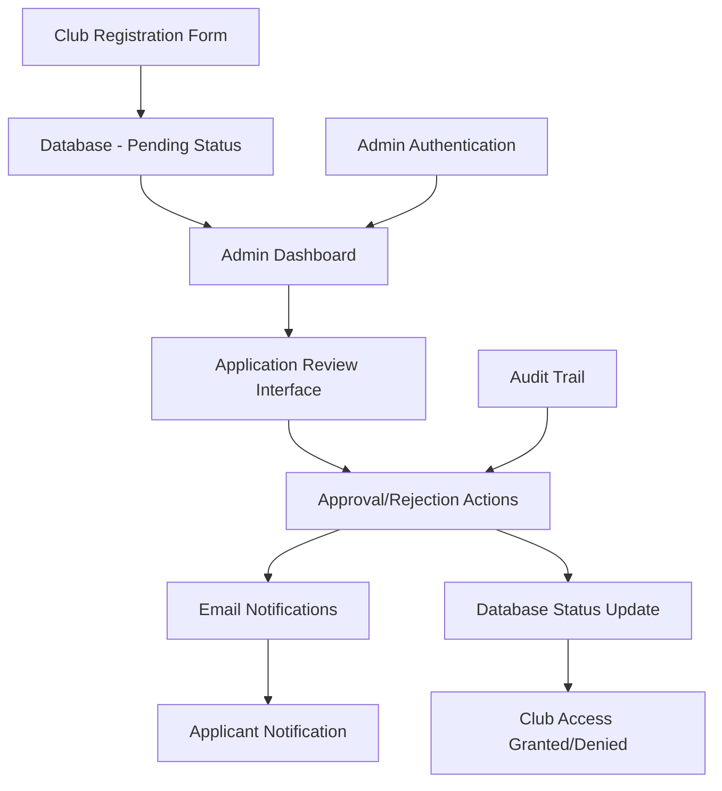

# Admin Club Approval Design Document

## Overview

The Admin Club Approval system provides a web-based interface for platform administrators to review, approve, or reject club registration applications. This system replaces the current manual database management approach with a user-friendly interface that includes proper workflow management, notifications, and audit trails.

The system leverages the existing admin roles infrastructure and extends the current club registration process to include an approval workflow. When clubs register, they will be in a "pending" state until an administrator reviews and approves their application.

## Architecture

### System Components



### Database Schema Extensions

The system will extend the existing database schema with the following modifications:

1. **Club Status Enhancement**: Modify the `clubs` table to include application status tracking
2. **Application History**: New table to track approval/rejection history
3. **Admin Actions**: Extend existing moderation system for club approvals

### Key Architectural Decisions

- **Leverage Existing Admin System**: Use the current `admin_roles` table and authentication
- **Status-Based Workflow**: Use club status field to control access and visibility
- **Email Integration**: Integrate with existing notification system
- **Audit Trail**: Maintain complete history of all approval decisions

## Components and Interfaces

### 1. Database Schema Changes

#### Extended Clubs Table
```sql
-- Add new columns to existing clubs table
ALTER TABLE clubs ADD COLUMN IF NOT EXISTS application_status TEXT DEFAULT 'pending' 
  CHECK (application_status IN ('pending', 'approved', 'rejected'));
ALTER TABLE clubs ADD COLUMN IF NOT EXISTS admin_notes TEXT;
ALTER TABLE clubs ADD COLUMN IF NOT EXISTS reviewed_by UUID REFERENCES auth.users(id);
ALTER TABLE clubs ADD COLUMN IF NOT EXISTS reviewed_at TIMESTAMP WITH TIME ZONE;
```

#### New Club Applications History Table
```sql
CREATE TABLE club_application_history (
  id UUID PRIMARY KEY DEFAULT uuid_generate_v4(),
  club_id UUID REFERENCES clubs(id) ON DELETE CASCADE,
  admin_id UUID REFERENCES auth.users(id) ON DELETE CASCADE,
  action TEXT NOT NULL CHECK (action IN ('approved', 'rejected', 'pending')),
  notes TEXT,
  created_at TIMESTAMP WITH TIME ZONE DEFAULT NOW()
);
```

### 2. Admin Dashboard Component

**Location**: `src/components/admin/ClubApprovalDashboard.tsx`

**Responsibilities**:
- Display summary statistics of pending applications
- Provide quick access to application review interface
- Show recent approval/rejection activity

**Key Features**:
- Pending applications count
- Quick action buttons
- Recent activity feed
- Search and filter capabilities

### 3. Application Review Interface

**Location**: `src/components/admin/ClubApplicationReview.tsx`

**Responsibilities**:
- Display detailed application information
- Provide approval/rejection actions
- Handle admin notes and decision recording

**Key Features**:
- Comprehensive application details view
- Contact information display with action buttons
- Decision form with required notes for rejections
- Application history timeline

### 4. Application List Component

**Location**: `src/components/admin/ClubApplicationList.tsx`

**Responsibilities**:
- Display paginated list of applications
- Provide filtering and sorting options
- Enable bulk operations

**Key Features**:
- Status-based filtering (pending, approved, rejected, all)
- Date range filtering
- Search by club name or email
- Sortable columns
- Bulk approval for qualified applications

### 5. Notification Service Extension

**Location**: `src/lib/notifications/club-approval.ts`

**Responsibilities**:
- Send approval/rejection emails to applicants
- Handle email template management
- Manage notification delivery and retry logic

**Email Templates**:
- Approval notification with login instructions
- Rejection notification with feedback
- Welcome email with platform guidance

### 6. API Service Layer

**Location**: `src/lib/supabase/admin-club-approval.ts`

**Functions**:
- `getPendingClubApplications()`: Fetch applications awaiting review
- `getClubApplicationById()`: Get detailed application information
- `approveClubApplication()`: Approve application and update status
- `rejectClubApplication()`: Reject application with reason
- `getApplicationHistory()`: Retrieve approval/rejection history
- `bulkApproveApplications()`: Handle multiple approvals

### 7. React Query Hooks

**Location**: `src/hooks/use-club-approval.ts`

**Hooks**:
- `usePendingApplications()`: Query pending applications with filtering
- `useClubApplication()`: Get single application details
- `useApproveApplication()`: Mutation for approval actions
- `useRejectApplication()`: Mutation for rejection actions
- `useApplicationHistory()`: Query application history

## Data Models

### Extended Club Interface
```typescript
interface Club {
  // ... existing fields
  application_status: 'pending' | 'approved' | 'rejected';
  admin_notes?: string;
  reviewed_by?: string;
  reviewed_at?: string;
}
```

### Application History Interface
```typescript
interface ClubApplicationHistory {
  id: string;
  club_id: string;
  admin_id: string;
  action: 'approved' | 'rejected' | 'pending';
  notes?: string;
  created_at: string;
  admin_email?: string; // Joined from admin_roles
}
```

### Application Review Data
```typescript
interface ClubApplicationReview {
  club: Club;
  history: ClubApplicationHistory[];
  admin_user?: {
    email: string;
    name?: string;
  };
}
```

### Approval Action Data
```typescript
interface ApprovalActionData {
  club_id: string;
  action: 'approve' | 'reject';
  admin_notes?: string;
  send_notification?: boolean;
}
```

## Error Handling

### Application-Level Errors
- **Authentication Failures**: Redirect to login with appropriate message
- **Authorization Failures**: Display access denied message with contact information
- **Network Errors**: Retry mechanism with user feedback
- **Validation Errors**: Clear field-level error messages

### Database-Level Errors
- **Constraint Violations**: Handle duplicate approvals gracefully
- **Foreign Key Errors**: Validate admin permissions before actions
- **Transaction Failures**: Rollback with clear error reporting

### Email Notification Errors
- **SMTP Failures**: Log errors and provide admin notification
- **Template Errors**: Fallback to basic text notifications
- **Delivery Failures**: Retry mechanism with exponential backoff

## Testing Strategy

### Unit Tests
- **Component Testing**: Test all admin components with mock data
- **Hook Testing**: Test React Query hooks with mock API responses
- **Service Testing**: Test API service functions with mock Supabase client
- **Validation Testing**: Test form validation and error handling

### Integration Tests
- **Approval Workflow**: End-to-end test of approval process
- **Rejection Workflow**: End-to-end test of rejection process
- **Email Integration**: Test notification sending and delivery
- **Database Integration**: Test schema changes and data consistency

### E2E Tests
- **Admin Login Flow**: Test admin authentication and authorization
- **Application Review**: Test complete review and decision process
- **Bulk Operations**: Test multiple application processing
- **Mobile Responsiveness**: Test admin interface on mobile devices

### Performance Tests
- **Large Dataset Handling**: Test with hundreds of pending applications
- **Concurrent Admin Actions**: Test multiple admins working simultaneously
- **Email Queue Performance**: Test notification system under load

## Security Considerations

### Authentication and Authorization
- **Admin Role Verification**: Verify admin status on every request
- **Session Management**: Proper session timeout and renewal
- **CSRF Protection**: Implement CSRF tokens for state-changing operations

### Data Protection
- **Sensitive Information**: Protect applicant contact information
- **Audit Trail Integrity**: Ensure approval history cannot be modified
- **Email Security**: Secure email templates and prevent injection

### Access Control
- **Row-Level Security**: Extend RLS policies for application data
- **API Endpoint Protection**: Secure all admin-only endpoints
- **Client-Side Validation**: Validate admin permissions in UI components

## Performance Optimization

### Database Optimization
- **Indexing Strategy**: Add indexes for application status and review dates
- **Query Optimization**: Optimize joins for application list queries
- **Pagination**: Implement efficient pagination for large datasets

### Frontend Optimization
- **Lazy Loading**: Load application details on demand
- **Caching Strategy**: Cache application lists with React Query
- **Virtual Scrolling**: Handle large application lists efficiently

### Email System Optimization
- **Queue Management**: Implement email queue for bulk notifications
- **Template Caching**: Cache email templates for better performance
- **Batch Processing**: Group notifications for efficiency

## Deployment Considerations

### Database Migration
- **Schema Updates**: Safe migration of existing club data
- **Data Backups**: Backup before applying schema changes
- **Rollback Plan**: Prepare rollback procedures for failed migrations

### Feature Rollout
- **Gradual Deployment**: Deploy to staging environment first
- **Admin Training**: Provide documentation and training for administrators
- **Monitoring**: Set up monitoring for approval system performance

### Maintenance
- **Log Management**: Implement comprehensive logging for troubleshooting
- **Performance Monitoring**: Monitor system performance and bottlenecks
- **Regular Audits**: Periodic review of approval decisions and system usage